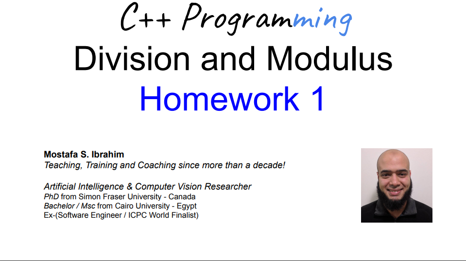

# Problem #1: Averages

- Write a program that reads 5 numbers and print the following:
  - A) Their average
  - B) The sum of the first 3 numbers divided by the sum of the last 2 numbers
  - C) The average of the first 3 numbers divided by the average of the last 2 numbers.
  - What is the math relation between B and C?
- Input 1 2 3 4 5
  - 3
  - 0.666666667
  - 0.44444444

# Problem #2: Fractional Part

- Write a program that reads 2 numbers a, b and divides them (a/b), but prints
  only the fraction part
- Input: 201 25
- Output: 0.04
  - Notice: 201 / 25 = 8.04
  - We only want the fraction part: 0.04

# Problem #3: Our remainder

- We know N % M computes the remainder of division
- Write a program that reads 2 positive integers and print such reminder without
  using the modulus operator %
- Input: 27 12
- Output: 3
  - Remember in math: 27 % 12 = 3
